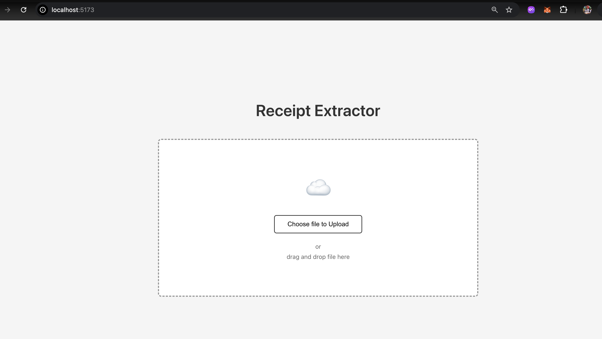
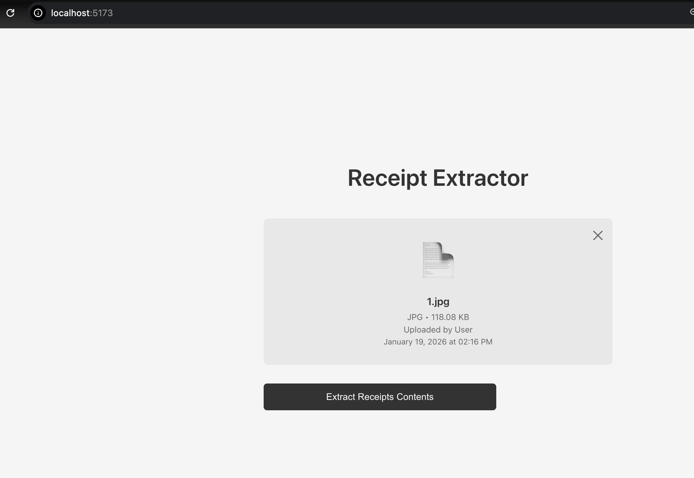
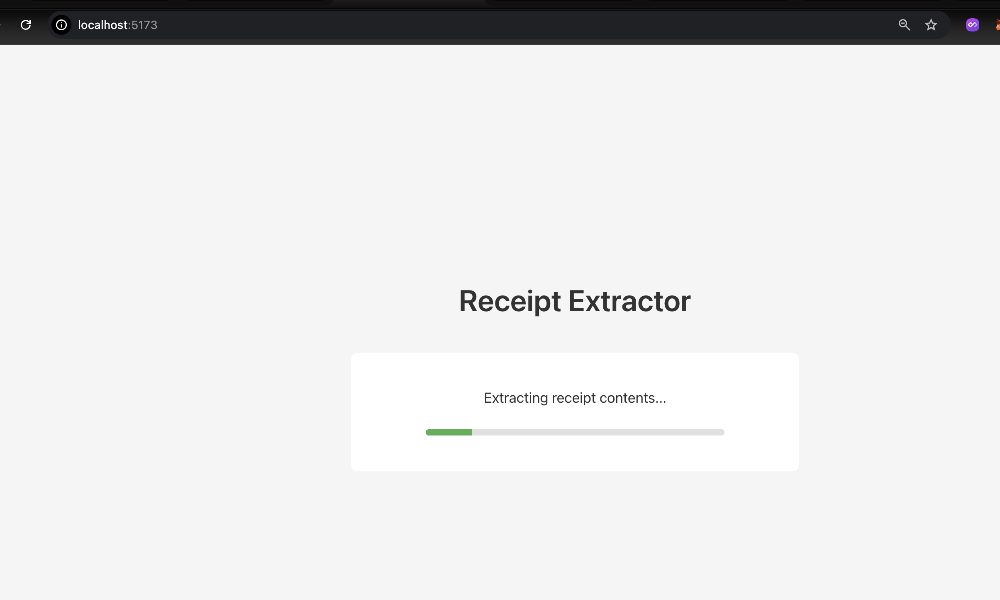
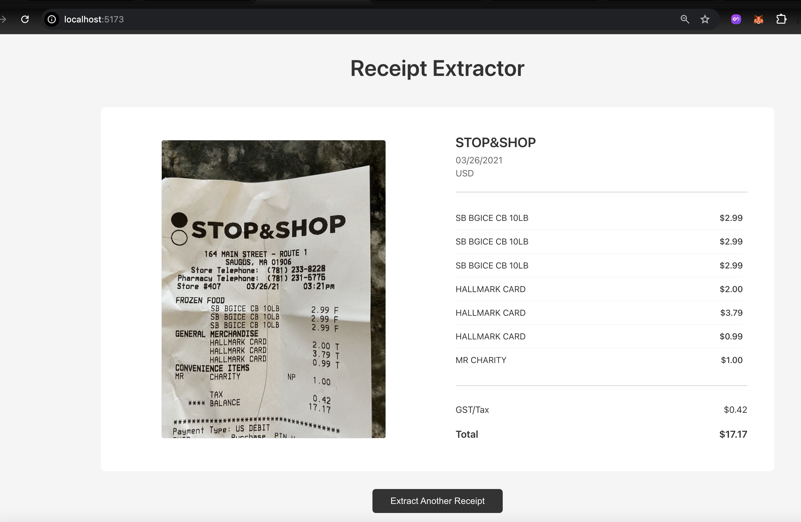

# AI Receipt Extractor

> 🧾 Full-stack AI-powered receipt data extraction system. Upload receipt images and automatically extract vendor information, itemized costs, taxes, and totals using state-of-the-art vision models.


---

## 🎯 Features

- **🤖 Multi-Provider AI Support** - Choose between Claude (Anthropic), Gemini (Google), OpenAI, or Mock mode
- **📸 Smart Image Processing** - Supports JPG, PNG, GIF, and WebP formats with drag-and-drop upload
- **🔄 Real-Time Extraction** - Live progress tracking during AI processing
- **💾 Persistent Storage** - PostgreSQL database with Prisma ORM for data persistence
- **☁️ Cloud Storage** - AWS S3 integration with LocalStack support for local development
- **✅ Data Validation** - Comprehensive validation using class-validator
- **🧪 Full Test Coverage** - 7/7 unit tests passing with mocked services
- **🎨 Modern UI** - Clean, responsive React interface with 5 distinct states
- **🔌 Factory Pattern** - Easy AI provider switching via environment configuration
- **🚀 Production Ready** - Comprehensive error handling and logging

---

## 🏗️ Architecture

```
┌─────────────────────────────────────────────────────────────┐
│                         Frontend                            │
│    React + TypeScript + Vite                                │
│    • Drag-and-drop upload                                   │
│    • Real-time progress tracking                            │
│    • Results visualization                                  │
└────────────────┬────────────────────────────────────────────┘
                 │ REST API
┌────────────────┴────────────────────────────────────────────┐
│                         Backend                             │
│    NestJS + TypeScript                                      │
│    ┌──────────────┐  ┌──────────────┐  ┌──────────────┐   │
│    │   Receipt    │  │   Storage    │  │   AI         │   │
│    │   Service    │  │   Service    │  │   Factory    │   │
│    └──────┬───────┘  └──────┬───────┘  └──────┬───────┘   │
│           │                  │                  │            │
│    ┌──────▼───────┐  ┌──────▼───────┐  ┌──────▼───────┐   │
│    │  Prisma ORM  │  │  AWS S3 SDK  │  │  Claude SDK  │   │
│    └──────┬───────┘  └──────────────┘  │  Gemini SDK  │   │
│           │                             │  OpenAI SDK  │   │
│    ┌──────▼───────┐                    └──────────────┘   │
│    │  PostgreSQL  │                                        │
│    └──────────────┘                                        │
└─────────────────────────────────────────────────────────────┘
```

---

## 📸 Screenshots

### Landing Page
*Upload your receipt image via drag-and-drop or file selection*



### File Preview
*Review selected file details before processing*



### Processing
*Real-time progress indicator during AI extraction*



### Results
*View extracted data with original receipt image*



---

## 🚀 Quick Start

### Prerequisites

- Node.js v18+ and npm v10+
- PostgreSQL (local or Docker)
- Docker (for LocalStack S3 emulation)
- API key for at least one AI provider (or use Mock mode)

### Installation

1. **Clone the repository:**
   ```bash
   git clone https://github.com/pjanusc85/ai-receipt-extractor.git
   cd ai-receipt-extractor
   ```

2. **Set up the backend:**
   ```bash
   cd backend
   npm install
   ```

3. **Configure environment:**
   ```bash
   cp .env.example .env
   # Edit .env with your configuration
   ```

4. **Set up database:**
   ```bash
   # Create PostgreSQL database
   psql postgres
   CREATE USER receipt_user WITH PASSWORD 'receipt123';
   ALTER USER receipt_user CREATEDB;
   CREATE DATABASE receipts OWNER receipt_user;
   \q

   # Run migrations
   npx prisma migrate dev
   ```

5. **Start LocalStack (for S3):**
   ```bash
   docker run -d -p 4566:4566 -p 4571:4571 localstack/localstack
   curl -X PUT http://localhost:4566/receipts
   ```

6. **Start the backend:**
   ```bash
   npm run start:dev
   # Backend running on http://localhost:3000
   ```

7. **Set up the frontend:**
   ```bash
   cd ../frontend
   npm install
   npm run dev
   # Frontend running on http://localhost:5173
   ```

8. **Open your browser:**
   ```
   Navigate to http://localhost:5173
   ```

---

## 🔧 Configuration

### AI Providers

The application supports multiple AI providers. Configure via `.env`:

#### Anthropic Claude (Recommended)
```env
AI_PROVIDER="claude"
ANTHROPIC_API_KEY="your-api-key"
```
[Get API Key](https://console.anthropic.com/settings/keys)

#### Google Gemini (FREE)
```env
AI_PROVIDER="gemini"
GEMINI_API_KEY="your-api-key"
```
[Get API Key](https://aistudio.google.com/app/apikey)

#### OpenAI
```env
AI_PROVIDER="openai"
OPENAI_API_KEY="your-api-key"
```
[Get API Key](https://platform.openai.com/api-keys)

#### Mock (No API Key Required)
```env
AI_PROVIDER="mock"
```
Returns realistic fake data for testing.

---

## 🧪 Testing

```bash
cd backend
npm test
```

**Test Coverage:**
- ✅ Successful receipt extraction
- ✅ Invalid file type handling
- ✅ AI response validation
- ✅ Error handling (storage, database, AI failures)

---

## 📊 Extracted Data

The system extracts the following information from receipts:

- **Date** (ISO 8601 format)
- **Currency** (3-letter code: USD, CAD, SGD, etc.)
- **Vendor Name**
- **Line Items** (name and cost for each)
- **Tax/GST** (single total)
- **Total Amount**

---

## 🛠️ Tech Stack

### Backend
- **Framework:** NestJS
- **Language:** TypeScript
- **Database:** PostgreSQL
- **ORM:** Prisma
- **Storage:** AWS S3 SDK (LocalStack for local dev)
- **AI:** Anthropic SDK, Google Generative AI, OpenAI SDK
- **Validation:** class-validator, class-transformer
- **Testing:** Jest

### Frontend
- **Framework:** React 19
- **Language:** TypeScript
- **Build Tool:** Vite
- **State Management:** useReducer
- **Styling:** CSS
- **API Client:** Fetch API

---

## 📁 Project Structure

```
ai-receipt-extractor/
├── backend/
│   ├── src/
│   │   ├── ai/                 # AI provider services
│   │   │   ├── ai.service.ts           # OpenAI implementation
│   │   │   ├── ai-claude.service.ts    # Claude implementation
│   │   │   ├── ai-gemini.service.ts    # Gemini implementation
│   │   │   ├── ai-mock.service.ts      # Mock for testing
│   │   │   └── ai.module.ts            # Factory pattern
│   │   ├── prisma/             # Database service
│   │   ├── receipt/            # Receipt processing logic
│   │   │   ├── dto/                    # Data transfer objects
│   │   │   ├── receipt.controller.ts
│   │   │   ├── receipt.service.ts
│   │   │   └── receipt.service.spec.ts
│   │   ├── storage/            # S3 storage service
│   │   └── main.ts
│   ├── prisma/
│   │   └── schema.prisma       # Database schema
│   ├── package.json
│   └── README.md
│
├── frontend/
│   ├── src/
│   │   ├── components/
│   │   │   ├── LandingPage.tsx
│   │   │   ├── FilePreview.tsx
│   │   │   ├── LoadingState.tsx
│   │   │   ├── ExtractionResults.tsx
│   │   │   └── ErrorState.tsx
│   │   ├── services/
│   │   │   └── api.service.ts
│   │   ├── types/
│   │   │   └── receipt.types.ts
│   │   ├── App.tsx
│   │   └── main.tsx
│   ├── package.json
│   └── README.md
│
├── sample-receipts/            # Sample images for testing
└── README.md
```

---

## 🌟 Key Features Explained

### Multi-Provider AI Support

The application uses a factory pattern to support multiple AI providers:

```typescript
// Easy switching via environment variable
AI_PROVIDER="claude"  // or "gemini", "openai", "mock"
```

This architecture allows:
- **Easy testing** with mock provider
- **Cost optimization** by switching to free providers (Gemini)
- **Flexibility** to use best-performing model
- **Fallback options** if one provider is unavailable

### Data Validation Pipeline

```
Image Upload → File Type Check → AI Extraction →
Data Validation → Database Storage → Return Results
```

Each step has proper error handling and validation:
1. File type must be JPG, PNG, GIF, or WebP
2. AI response must match expected schema
3. Data validation using decorators (class-validator)
4. Database constraints ensure data integrity

---

## 🚢 Deployment

### Backend (Railway / Render / Heroku)

1. Set up PostgreSQL database
2. Configure S3 bucket (or use Railway's storage)
3. Set environment variables
4. Deploy backend

### Frontend (Vercel / Netlify)

1. Update API base URL
2. Deploy frontend
3. Configure environment variables

### Docker Deployment

```bash
# Coming soon: Docker Compose setup
docker-compose up
```

---

## 🗺️ Roadmap

- [ ] Docker Compose for one-command setup
- [ ] CI/CD pipeline with GitHub Actions
- [ ] Batch processing for multiple receipts
- [ ] Export to CSV/Excel
- [ ] Receipt categorization and analytics
- [ ] Mobile app (React Native)
- [ ] OCR fallback for non-AI processing
- [ ] Multi-language support
- [ ] Receipt search and filtering
- [ ] User authentication and multi-tenancy

---

## 🤝 Contributing

Contributions are welcome! Please feel free to submit a Pull Request.

1. Fork the repository
2. Create your feature branch (`git checkout -b feature/AmazingFeature`)
3. Commit your changes (`git commit -m 'Add some AmazingFeature'`)
4. Push to the branch (`git push origin feature/AmazingFeature`)
5. Open a Pull Request

---

## 📝 License

This project is licensed under the MIT License - see the [LICENSE](LICENSE) file for details.

---

## 👤 Author

**Paul Calinawa**
- GitHub: [@pjanusc85](https://github.com/pjanusc85)
- LinkedIn: [Paul Calinawa](https://linkedin.com/in/pjanusc85)

---

## 🙏 Acknowledgments

- [Anthropic](https://www.anthropic.com/) for Claude AI
- [Google](https://ai.google.dev/) for Gemini AI
- [OpenAI](https://openai.com/) for GPT-4 Vision
- [NestJS](https://nestjs.com/) for the amazing framework
- [Prisma](https://www.prisma.io/) for the excellent ORM

---

## 📧 Support

If you have any questions or need help, please open an issue or reach out directly.

---

<p align="center">Made with ❤️ and TypeScript</p>
